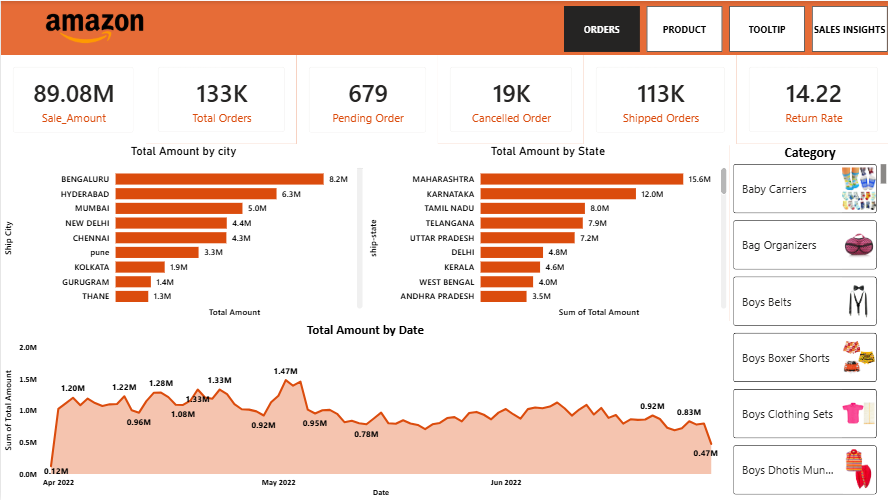

🛒 Amazon Sales Performance Dashboard
 

📌 Project Overview

This interactive Power BI Dashboard analyzes Amazon's sales performance across India, providing deep insights into Orders, Products, and Sales trends from April 2022 to June 2022. Data was collected using Web Scraping techniques via Python.

📊 Key Metrics
MetricValue 
💰 Total Sale Amount    89.08M 
📦 Total Orders         133K 
⏳ Pending Orders       679 
❌ Cancelled Orders     19K 
🚚 Shipped Orders       113K
🔄 Return Rate          14.22

🗂️ Dashboard Pages

📋 Orders Page
. Total Amount by City (Top 10) . Total Amount by State . Total Amount by Date (Line Chart) . Category wise product images

📦 Product Page
. Product wise sales analysis . Category performance

🔍 Tooltip Page
. Interactive tooltips for detailed insights

💡 Sales Insights Page
. Deep dive into sales trends 
. Performance analysis

🔍 Key Insights
📌 Bengaluru & Maharashtra are top performing city and state
📌 113K orders shipped out of 133K total orders 
📌 Return rate of 14.22 indicates room for improvement 
📌 Sales peaked in May 2022 then gradually declined 
📌 19K cancelled orders — cancellation analysis needed

🛠️ Tools Used
Tool Purpose Power BI    Desktop Dashboard creation & visualization 
Python Web scraping to collect data 
Jupyter Notebook Python scripting environment 
Power Query Data cleaning & transformation 
DAXCalculated measures & KPIs

📁 Project Structure
Amazon-Sales-Dashboard/ │ ├── 📊 AMAZON SALES DASHBOARD.pbix # Power BI Dashboard file ├── 🖼️ Amazon Dashbord.png # Dashboard preview image ├── 🐍 Web_Scrapping.ipynb # Python web scraping notebook └── 📝 README.md # Project documentation

🐍 Web Scraping
Data was collected using Python web scraping
:Library used : BeautifulSoup / Requests Source 
: Amazon product listings Data collected 
: Product names, prices, categories, orders, shipping details Notebook 
: Web_Scrapping.ipynb

🚀 How to Use

 Clone or download this repository
 Open Web_Scrapping.ipynb in Jupyter Notebook to see data collection process
 Open AMAZON SALES DASHBOARD.pbix in Power BI Desktop
 Navigate between Orders, Product, Tooltip, Sales Insights pages
 Use Category filter to analyze specific products
 Hover over charts for detailed tooltips 

👩‍💻 Author 
Nandani 
🔗 GitHub: @nandani2201 
💼 Aspiring Data Analyst
